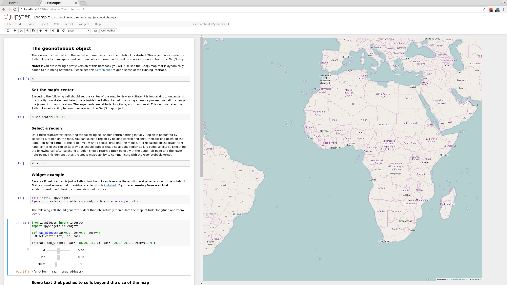

## GeoNotebook [](https://circleci.com/gh/OpenGeoscience/geonotebook)
GeoNotebook is an application that provides client/server
enviroment with inteactive visualization and analysis capabilities
using [Jupyter](http://jupyter.org), [GeoJS]
(http://www.github.com/OpenGeoscience/geojs) and other open source tools.
Jointly developed by  [Kitware](http://www.kitware.com) and
[NASA Ames](https://www.nasa.gov/centers/ames/home/index.html).


## Screenshots


Checkout some additional [screenshots](screenshots/)

## Installation
### Clone the repo:
```bash
git clone git@github.com:OpenGeoscience/geonotebook.git
cd geonotebook
```
### Make a virtualenv, install jupyter[notebook], install geonotebook
```bash
mkvirtualenv -a . geonotebook

pip install -r requirements.txt

pip install .

# Optionally you may do a development install, e.g.
# pip install -e .
```

*Note* The geonotebook package has been designed to install the notebook extension etc automatically. You should not need to run ```jupyter nbextension install ...``` etc.

### Ensure a running instance of geoserver (for tile serving)
```
cd devops/geoserver/
vagrant up
```

### Run the notebook:
```bash
cd notebooks/
jupyter notebook

```

### Run the tests
```bash
# From the source root
pip install -r requirements-dev.txt
python setup.py test
```


