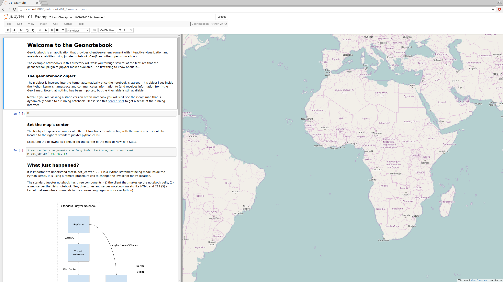

Overview
=======================================

GeoNotebook is an extension to the `Jupyter Notebook <http://jupyter.org>`_ that provides interactive visualization and python-based analysis of geospatial data. It is built with open source tools and is being jointly developed by `Kitware <http://www.kitware.com>`_ and `NASA Ames <https://www.nasa.gov/centers/ames/home/index.html>`_.

Goals
^^^^^

GeoNotebook's concrete goals are to provide a web based analysis tool that:

  #. Supports reproducible, exploratory analysis with a focus on geospatial data and formats.
  #. Provides easy deployment of a secure analysis environment close to where data is stored.
  #. Can be extended to support a wide array of data access and visualization contexts.

Audience
^^^^^^^^

GeoNotebook is designed to appeal too, and hopefully meet the needs of, several audiences:

  * Geospatial experts who are interested in using state of the art data science tools like the Jupyter Notebook to explore their data and share their findings.
  * Data scientists who are already using the python data analytics stack (e.g. numpy, pandas, matplotlib, jupyter, etc) but find current geospatial libraries to be confusing or burdensome.
  * Technical managers of large quantities of geospatial data who are looking to maximize usage by provide analysis environments that are "closer" their data.

Architecture
^^^^^^^^^^^^

GeoNotebook extends the Jupyter Notebook interface by adding a large `Open Street Map <https://www.openstreetmap.org/#>`_ style map to the right of the traditional notebook cells.

We provide a python API from with-in the notebook cells for visualizing raster and vector data on the map as well as basic tools for selecting regions of the visualized data and making those subsets available for analysis back in the notebook.

GeoNotebook consists of extensions to three components of the Jupyter Notebook, these include `Custom request handlers <http://jupyter-notebook.readthedocs.io/en/latest/extending/handlers.html>`_ (also called a 'server extension'), a `Custom front-end extension <http://jupyter-notebook.readthedocs.io/en/latest/extending/frontend_extensions.html>`_ (also called an 'nbextension') and a `simple Python wrapper kernel <http://jupyter-client.readthedocs.io/en/latest/wrapperkernels.html>`_ called the GeoNotebook kernel.

Unlike some other interactive geospatial extensions to the Jupyter Notebook,  GeoNotebook is *not* built on top of the excellent `widgets <http://jupyter.org/widgets.html>`_ infrastructure.  Instead GeoNotebook relies directly on Jupyter's `custom message <http://jupyter-client.readthedocs.io/en/latest/messaging.html#custom-messages>`_ comm protocol to coordinate communication between the JavaScript map and the in-notebook python API. While this increases the underlying complexity of the code,  it provides a more flexible development environment for implementing GeoNotebook's user interface.

GeoNotebook extends Jupyter's web server to provide a fully integrated default tile server based on `KTile <https://github.com/OpenGeoscience/KTile>`_ (a fork of `TileStache <https://github.com/TileStache/TileStache>`_), `Mapnik <https://github.com/mapnik/mapnik>`_, and `GDAL <http://www.gdal.org/>`_ into the notebook.  This tile server allows data to be rendered server-side and delivered as down sampled images for visualization while full resolution access to the data is still available via the notebook cells.

GeoNotebook is designed with a modular structure to support different visualization servers and different methods for data access. For example, while Ktile provides the default visualization server, GeoNotebook is written to allow support for other visualization servers,  for example external instances of `Geoserver <http://geoserver.org/>`_.

.. seealso:: :doc:`developer-docs`
