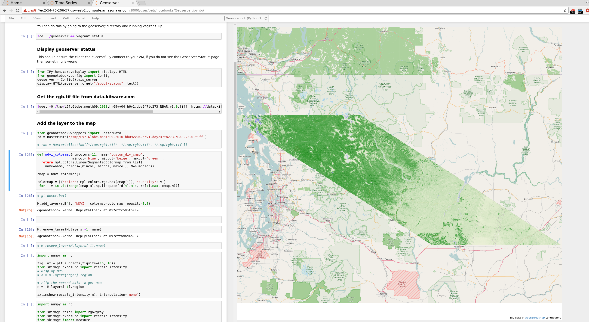
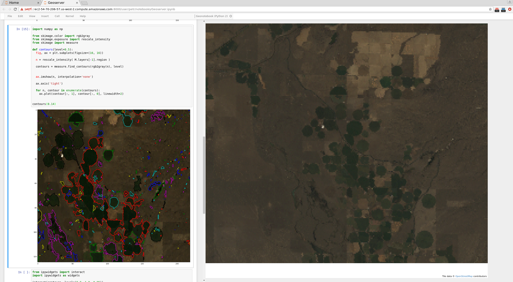
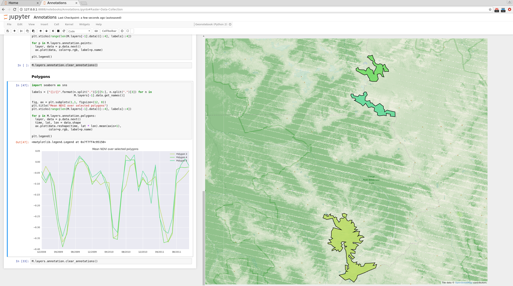
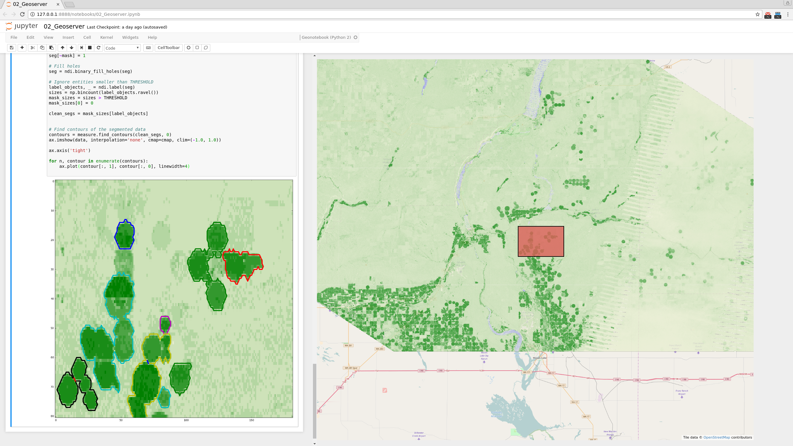

### World Wide View
The geonotebook is designed to provide a dynamic interactive map for visualization and analysis of geospatial data in a familiar jupyter notebook format. On the left is a standard jupyter notebook. On the right a is a [GeoJS](http://opengeoscience.github.io/geojs/examples/index.html) map. Geonotebook connects these two allowing the python cells to visualize data on the map and regions of this data to be selected on the map for further analysis. 

### NDVI layer 
Here we've added an NDVI layer from a Geotiff to the notebook for analysis.

### Some RGB layers with analysis
Here we've added RGB layers from a Geotiff. On the right we've zoomed way in on an area north of Moses Lake WA. We've selected a region from an agricultural area and on the left we're performing a rudimentary segmenting analysis to determine the number of fields.

### Annotations
Geonotebook supports point, rectangle,  and polygon annotations. the region of data selected by the annotation(s) becomes available for further analysis.  In this example we have loaded the NBAR data from 12/2008 through 11/2011 into a RasterDataCollection.  We've then added the NDVI band to the map as a layer and selected several glaciers in Washington state's  Glacier Peak Wilderness Area. The chart on the left displays a time series of mean NDVI for each of the glacier regions. Polygon color on the map corresponds to line color for the chart.

### Segment Analysis
Data from annotations is provided as numpy arrays.  This means you are free to perform any additional analysis you wish on the data.  For instance here we show using [scikit-image](http://scikit-image.org/)'s [segmentation tutorial](http://scikit-image.org/docs/stable/user_guide/tutorial_segmentation.html) to identify fields in an annotated region.

